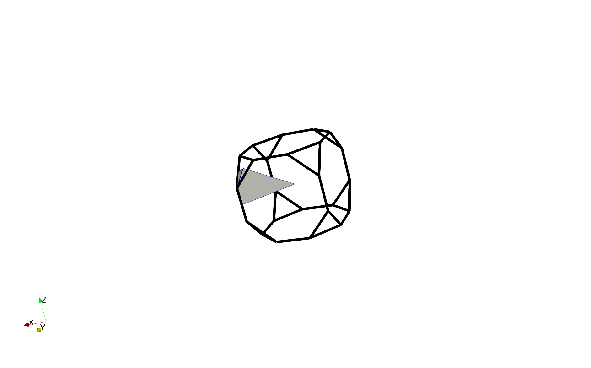
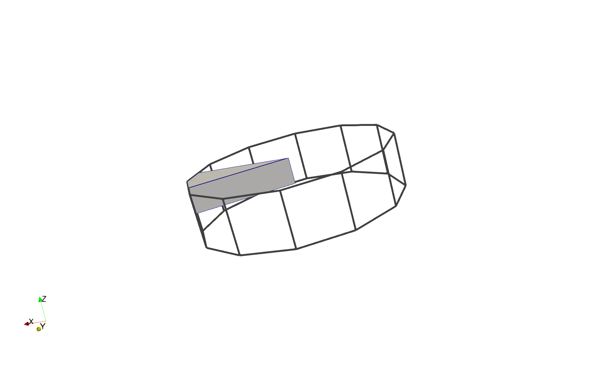
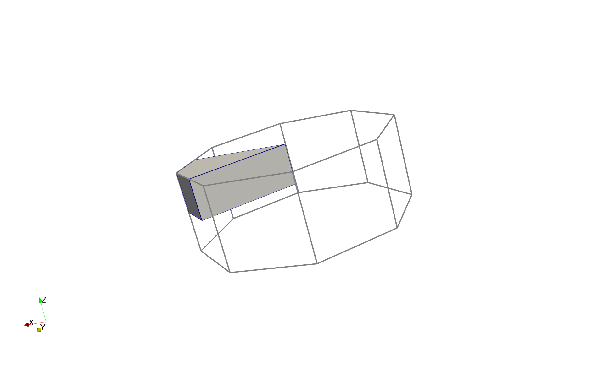
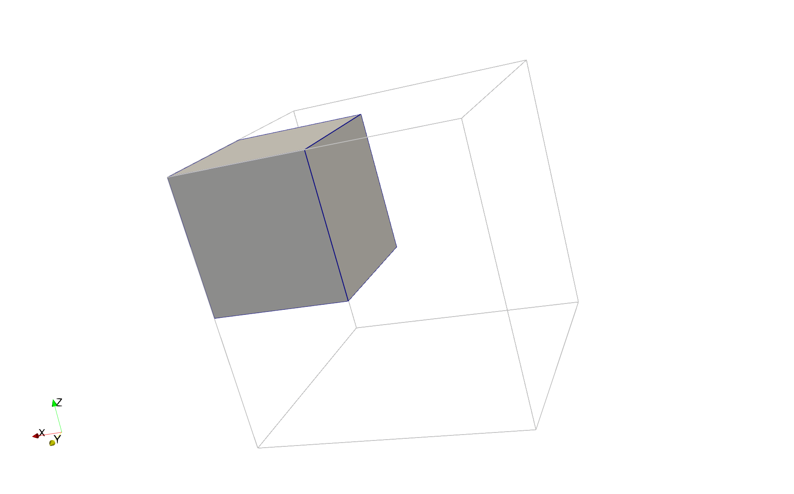

# FundamentalZones

This repository holds VTK files of mesh representations in Rodrigues space of the Fundamental Zone (FZ) of selected orientations and disorientations.

## Rodrigues space

In Rodrigues space a rotation is expressed as a 3D vector whose

* **direction** is the **axis of rotation** (a unit vector),
* **magnitude** represents the **rotation angle**.

Specifically, the Rodrigues vector is expressed as $\mathbf{r} = \tan\left(\frac{\theta}{2}\right) \, \mathbf{u}$  where

* $\theta$ is the angle of rotation,
* $\mathbf{u}$ is the axis of rotation (a unit vector).

This creates a 1:1 mapping between rotations (up to ±π) and points in 3D space.

## Visualization

### Orientation Fundamental Zones

In order of increasing volume (decreasing degree of symmetry), the below animated volume contains the FZs for the four lattice symmetries:

* cubic
* hexagonal
* tetragonal
* orthorhombic

### Disorientation Fundamental Zones

The solid volume inside the orientation Fundamental Zone(s) shown below represents the corresponding disorientation Fundamental Zone.

#### Cubic

#### Cubic–Orthorhombic

#### Hexagonal

#### Tetragonal

#### Orthorhombic

